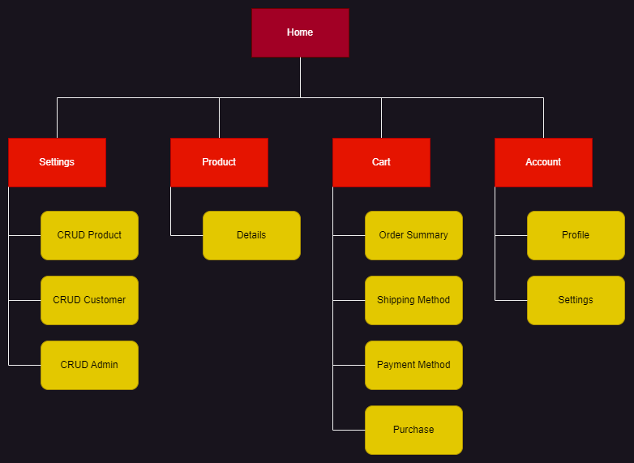

# _CAASO Eyewear Store_ 
Projeto desenvolvido para a disciplina _SCC0219 - Introdução ao Desenvolvimento Web (2023)_

## Project Report

### Alunos do Grupo 21

| Nome | NUSP |
| ------ | ------ |
| Bernardo Rodrigues Tameirão Santos | 12733212 |
| Felipe Henrique de Oliveira | 11272811 |
| Matheus Giraldi Alvarenga | 12543669 |

## Requisitos
- O sistema tem 2 tipos de usuários: Clientes e Administradores.

- Administradores são responsáveis por cadastrar/gerenciar administradores, clientes e produtos fornecidos. A aplicação já vem com uma conta admin com a senha admin.

- Os registros de administrador incluem, pelo menos: nome, id, telefone, e-mail.

- Cada registro de cliente inclui, pelo menos: nome, id, endereço, telefone, e-mail.

- Os registros de produtos incluem, pelo menos: nome, id, foto, descrição, preço, quantidade (em estoque), quantidade vendida.

- Venda de produtos: os produtos são selecionados, a quantidade escolhida e incluídos em um carrinho. Os produtos são comprados usando um número de cartão de crédito (qualquer número é aceito pelo sistema). A quantidade de produto vendido é subtraída da quantidade em estoque e adicionada à quantidade vendida. Os carrinhos são esvaziados apenas no pagamento ou pelos clientes.

- Gerenciamento de produtos/serviços: Administradores podem criar/atualizar/lê/deletar (CRUD) novos produtos e serviços. Por exemplo, eles podem mudar a quantidade em estoque.

- O sistema deve fornecer requisitos de acessibilidade e oferecer boa usabilidade. O sistema deve ser responsivo, ou seja, ele deve concluir as tarefas atribuídas dentro de um tempo razoável.

## Descrição do Projeto

Nosso projeto é uma loja virtual que vende óculos. Os usuários podem navegar pelos produtos e adicioná-los a um carrinho. Antes de inserir as informações do cartão de crédito, os usuários precisam inserir informações de entrega, caso a entrega seja em um novo endereço ou o usuário não esteja logado. Quando eles estiverem prontos para fazer o check-out, eles podem inserir um número de cartão de crédito válido para concluir a compra. As compras são registradas em um histórico de pedidos para referência futura.

Os administradores podem criar, atualizar, ler e excluir produtos e gerenciar o estoque. Eles também podem adicionar novos administradores e clientes. A interface do administrador é protegida por senha para garantir a segurança.

### Diagrama de Navegação

### [Mockup do site CAASO Eyewear no FIGMA](https://www.figma.com/file/8UUIxMVwJ5aWvJciDRd1N9/Trabalho-WEB?type=design&node-id=3%3A2&t=hfZTwQtrPaKur3k5-1)

## Comentários Sobre o Código
As páginas HTML5/CSS3 desenvolvidas para essa primeira etapa foram as telas de início (home - obrigatória), carrinho (cart) e a de alteração dos dados de um usuário (user update - representando nosso modelo de CRUD).

## Plano de teste

### Produtos

### Produto Específico

Para testar as funcionalidades de um produto específico no carrinho de compras, siga os seguintes passos:

- Selecionar a quantidade de óculos e adicionar ao carrinho:

  - Abra a página do produto desejado.
  - Localize o campo de seleção de quantidade.
  - Escolha uma quantidade desejada de óculos.
  - Clique no botão "ADD TO CART".
  - Verifique se a quantidade selecionada é exibida corretamente no carrinho.

- Verificar o controle de estoque:

  - No mesmo produto, tente selecionar uma quantidade maior do que a disponível em estoque.

Ao realizar esses testes com um produto específico, você poderá verificar se as funcionalidades de seleção de quantidade e controle de estoque estão operando corretamente. Certifique-se de observar se a quantidade selecionada é refletida corretamente no carrinho e se a validação de estoque está funcionando adequadamente.

### Carrinho

- Adicionar produtos ao carrinho:
  
  - Selecione um produto disponível na loja.
  - Clique no botão "ADD TO CART".
  - Verifique se o produto é exibido corretamente no carrinho.

- Exibir o preço total corretamente:

  - Adicione vários produtos diferentes ao carrinho.
  - Verifique se o preço total é atualizado corretamente, refletindo a soma dos preços individuais dos produtos.

- Excluir produtos individualmente do carrinho:

  - Adicione alguns produtos ao carrinho.
  - Localize um produto específico na lista do carrinho.
  - Clique no ícone de lixeira ao lado do produto.
  - Verifique se o produto é removido corretamente do carrinho.

- Resetar o carrinho completamente:

  - Adicione alguns produtos ao carrinho.
  - Localize a opção de "Reset Cart".
  - Clique na opção para remover todos os produtos do carrinho.
  - Verifique se o carrinho fica vazio, sem nenhum produto adicionado anteriormente.

## Resultado dos testes

## Processos de Construção
Para clonar o repositório utilizando o Git, utilize o seguinte comando: 

`git clone https://github.com/fdotoliveira/caaso-eyewear-store.git`

Para executar o site, é necessário ter o Node.js e o gerenciador de pacotes npm instalados em seu sistema. Além disso, é comum utilizar o json-server como uma ferramenta para fornecer dados fictícios durante o desenvolvimento da aplicação. O json-server permite criar uma API REST falsa com base em um arquivo JSON, o que é útil para testar e visualizar o funcionamento do site com dados predefinidos antes de ter uma API completa.

Portanto, após instalar o Node.js e o npm, é recomendado instalar o json-server com o comando "npm install json-server". Após essa etapa, acesse o diretório 'front-end' dentro da pasta 'caaso-eyewear-store' do projeto e execute os comandos a seguir:

`npm install`

Execute o back-end com json-server:

`npm run backend`

Execute o front-end:

`npm start`

## Problemas
Pressão de prazos: Devido a um cronograma apertado, tivemos que lidar com o desafio de criar várias páginas no projeto em um período de tempo limitado.

Dificuldade no uso do React: Enfrentamos dificuldades ao trabalhar com a biblioteca React, seja na compreensão de seus conceitos ou na implementação eficiente das funcionalidades desejadas.

Apesar dos warning gerados pelo compilador do React, entendemos que os avisos atuais não parecem ter um impacto negativo no desenvolvimento da aplicação e planejamos abordá-los em um momento posterior, considerando que esta não é a versão final do projeto.
## Comentários

